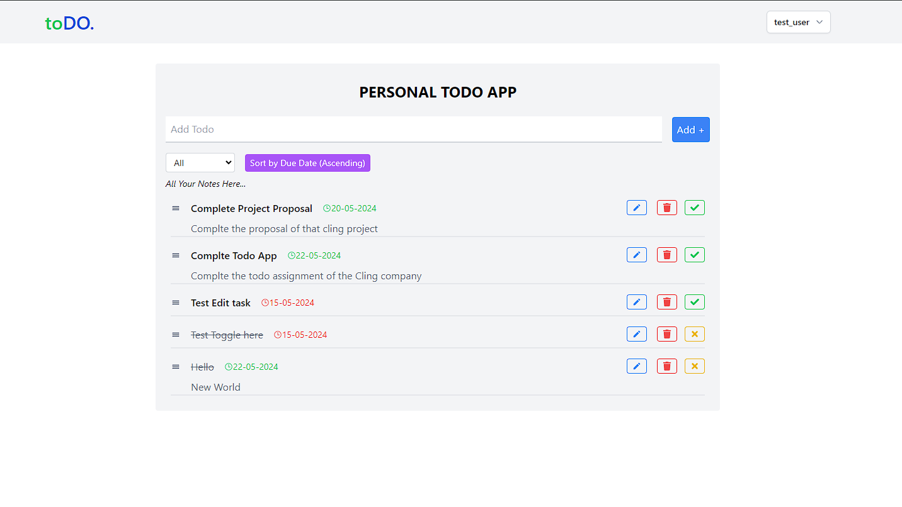

# Personal Todo App

A personal Todo app that allows users to manage their tasks with features such as adding, editing, deleting, filtering, sorting by due date, and drag-and-drop reordering.

## Table of Contents

- [Features](#features)
- [Demo](#demo)
- [Deployed Link](#deployed-link)
- [Installation](#installation)
- [Usage](#usage)
- [Technologies Used](#technologies-used)
- [API Endpoints](#api-endpoints)
- [License](#license)

## Features

- Add new todos with a title, description, and due date.
- Edit existing todos.
- Delete todos.
- Mark todos as complete or incomplete.
- Filter todos by status (All, Completed, Incomplete).
- Sort todos by due date.
- Drag-and-drop to reorder todos.
- Responsive design for mobile and desktop views.

## Demo



## Deployed Link

Check out the live version of the app [here](https://todo-assessment-client.onrender.com)

## Installation

1. Clone the repository:

   ```bash
   git clone https://github.com/hari-bot/todo-assessment.git
   cd todo-assessment
   ```

2. Install and start client:

   ```bash
   cd client
   npm install
   npm start
   
   ```

3. Install and Start the server:

   ```bash
   cd server
   npm install
   node index.js
   
   ```

## Usage

1. Open your browser and navigate to `http://localhost:3000`.
2. Use the input field to add new todos.
3. Click on the todo items to mark them as complete/incomplete.
4. Use the edit and delete buttons to modify or remove todos.
5. Drag and drop todos to reorder them.
6. Use the filter dropdown to view all, completed, or incomplete todos.
7. Use the sort dropdown to sort todos by their due dates.

## Technologies Used

- **Frontend:** React, Tailwind CSS, Formik, Yup, React Icons, Dnd-Kit
- **Backend:** Node.js, Express, MongoDB (assuming backend details if applicable)


## API Endpoints

- `GET /tasks/:userID` - Fetch all tasks for a user.
- `POST /tasks/:userID` - Add a new task.
- `PATCH /tasks/:taskID` - Edit an existing task.
- `PATCH /tasks/complete/:taskID` - Toggle completion status of a task.
- `DELETE /tasks/:taskID` - Delete a task.

## License

This project is licensed under the MIT License. See the [LICENSE](LICENSE) file for details.
